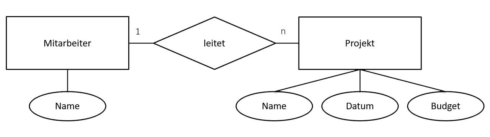

# Entity-Relationship (ER)
Das ER Beschreibt lediglich nur das Konzept und nicht die grafische Darstellung.
Es legt fest:
- Es gibt Entitäten
- Es gibt Attribute
- Es gibt Bedziehungen

Ein ER allein ist kein Diagramm, es stellt lediglich die Theroie dahinter da.

---

# Entity-Relations-Modell (ERM)

Das ERM ist das grafische Modell, das die ER Theorie nutzt.
Es gibt zwei Notations- (Darstellungs) Fromen.

## 1. Chen-Notiotion
*Entitäten*: Rechtecke
*Attribute*: Ovale
*Bedziehungen*: Rauten

### Beispiel:


## 2. Min-Max-Notation
*Entitäten*: Rechtecke
*Attribute*: Stehen Im Rechteck
*Beziehungen*: Linien mit Kardinalitäten

### Beispiel:
```txt
[Kunde] 1 ----- n [Bestellung]

Kunde:
- kunden_id (PK)
- name
- plz

Bestellung:
- bestell_id (PK)
- datum
- kunden_id (FK)
```
